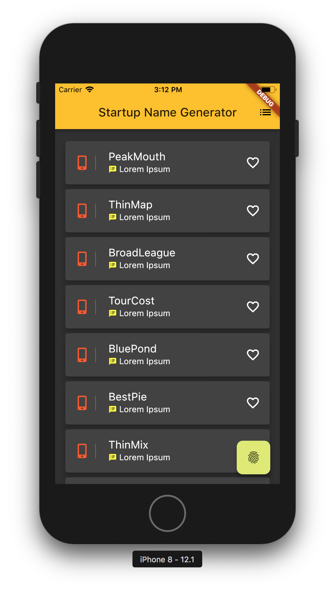

= app1

Simple Flutter project derived from the hello-world app flutter tutorial.

//

== Origin Getting Started

This app is derived from the following tutorials

- https://flutter.io/docs/get-started/codelab[Lab: Write your first Flutter app]
- https://flutter.io/docs/cookbook[Cookbook: Useful Flutter samples]

== Inspiration

Current UI inspired by the following blogs or Stackoverflow answers

 - https://proandroiddev.com/flutter-thursday-02-beautiful-list-ui-and-detail-page-a9245f5ceaf0
 - https://medium.com/@afegbua/this-is-the-second-part-of-the-beautiful-list-ui-and-detail-page-article-ecb43e203915
 - https://medium.com/@dev.n/the-complete-flutter-series-article-3-lists-and-grids-in-flutter-b20d1a393e39
 - https://medium.com/flutter-community/flutter-listview-and-scrollphysics-a-detailed-look-7f0912df2754
 - http://bizz84.github.io/2018/09/13/BottomBar-Navigation-with-FAB.html
 - https://stackoverflow.com/questions/51904495/how-to-change-a-text-style-on-flutter-when-button-pressed
 - https://stackoverflow.com/questions/43928702/how-to-change-the-application-launcher-icon-on-flutter
 - https://stackoverflow.com/questions/46694153/changing-the-project-name/46694910
 - https://sergiandreplace.com/planets-flutter-creating-a-list-of-planets/
